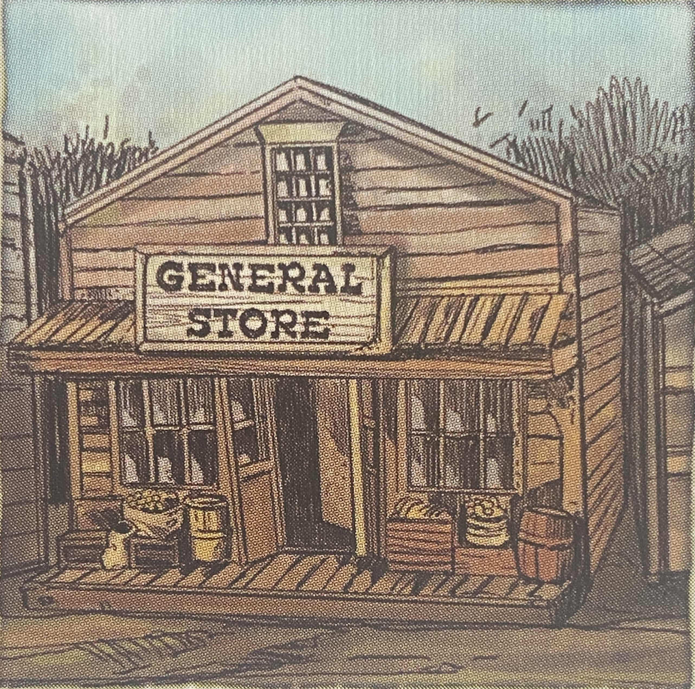

# A kártyákról részletesen
A kártya neve után a zárójelben két szám látható: hány darab van a lapból a törvény emberének paklijában / a törvényen kívüli paklijában. Ezt követi a kártya részletes leírása.  
Az aranyszabály: ha a kártya szövege ellentmond a játékszabálynak, mindig a kártya hatása érvényes.

Minden "Találat" kártya (és általánosságban minden "Találat" szimbólum) elől ki térni "Kitérés" kártyával (és általánosságban minden "Kitérés" szimbólummal). Viszont ha egy kártya szöveke "1 életpont elveszítéséről" beszél, az nem elkerülhető (például a "Kitérés" szimbólummal).  
Amikor egy kártya vagy képesség azt írja, hogy "a szereplő egy "Találat" szimbólum célpontja, akkor ez a hatás automatikus, és a normális szabályok szerint lehet kitérni előle.

**Bank** (1/0): A húzás fázisban eggyel több lapot húzz fel.

**Colt** (1/5): "Találat"

**Csörgőkígyó** (0/1) "Mindig aktív" Köröd elején fedd fel a paklid legfelső kártyáját! Ha a jobb felső sarokban látható szimbólum "Kígyó", szereplőd elveszít 1 életpontot. A *"Dinamit"* kártyával ellentétben, ez a kártya nem cserél gazdát: addig marad játékban, amíg a szereplő, aki elé kijátszották, el nem veszíti utolsó életpontját vagy a lapot el nem távolítják a játékból (pl. *"Lopás"* akciókártyával).

**Derringer** (4/0) "Találat" Ellenfeled bármilyen lap eldobásával kitérhet a támadás elől. A Derringer nem BANG! kártya. Kivédhető a *"Hordó"*, Annie Oakey képességével vagy akár a *"Visszatámadás"* akciókártyával is.

**Dinamit** (0/1) "Mindig aktív" Csak a hátvédedre játszhatod ki. A köröd kezdetén fedd fel a pakli legfelső lapját. Ha a felfedett kártyán szerepel a "Dinamit" szimbólum, a dinamit felrobban, és dinamittal rendelkező szereplő elveszít 3 életpontot. Ha a dinamit nem robbant fel, akkor a dinamitkártya átkerül ellenfeled hátvédje elé. Amikor ez után az ellenfeledre kerül a sor, ő is felfed egy kártyát, és ellenőrzi, hogy felrobbant-e a dinamit, és így, tovább, amíg a dinamit fel nem robban, vagy kártya valamilyen más úton el nem hagyja a játékot (pl. *"Lopás"* akciókártyával).

**Fegyvertáska** (1/1): Ha aktív szereplődé a fegyvertáska, akkor a köröd során akárhány BANG! kártyát kijátszhatsz! (Vagyis amíg a fegyvertáska az aktív szereplődnél van, a kijátszott BANG! kártyáidat egyáltalán nem vesszük figyelembe az egy körben kijátszható BANG! kártyák számára vonatkozó korlátozás kapcsán.) Ha a fegyvertáskás szereplőddel kijátszol egy vagy több BANG! kártyát, majd átmozgatod az aktívszereplő-jelződet, az új aktív szereplőddel kijátszhatsz még egy BANG! kártyát, hiszen a fegyvertáskával kijátszott BANG! kártyák nem számítottak bele a korlátozásba.

**Gatling** (1/0): "Találat" Az aktív szereplődön kívül minden játékban lévő szereplőre rálősz. Minden egyes szereplő kapcsán a tulajdonosnak döntenie kell, hogy kijátszik egy "Kitérés" kártyát, valamilyen más "Kitérés" hatással kerüli el a találatot, vagy elveszít 1 életpontot. A *"Hordó"* és *"Kalap"* kártyák használhatók a kitéréshez. Azon szereplők képességei is működnek, amelyek "Találat" hatásra reagálnak. Ilyen például Delon Ranger és Alan Pinkertoon. A *"Gatling"* nem BANG! kártya.

**Gyorstüzelő** (2/0): "Kitérés" Célpontod annyi találatot szenved el, ahány darab fölszereléskártya van kijátszva az adott szereplőhöz. Minden egyes találatot külön-külön kell elkerülnie. Ha a célpontnál van "Hordó" kártya, akkor mindan egyes találatot megpróbálhat azzal elkerülni. Ha a *"Gyorstüzelés"* kártyát Tex Killer játssza ki, minden egyes találatot plusz egy kártyával kell elkerülnie a célpontnak. Nem célozhatod meg ezzel ellenfeled hátvédét, kivéve Jack Ransome használatával vagy *"Távcsöves puska"* kártyával.

**Hordó** (1/1): Minden alkalommal, amikor olyan szereplő a célpontja egy "Találat"-nak, akinek van *"Hordó"* felszereléskártyája (még akkor is, ha Alan Pinkertoon, egy *"Gatling"* vagy *"Kés"* célpontja, és akkor is, ha éppen hátvéd), felfedheted a pakli legfelső lapját. Ha a felfedett lapon a "Hordó" szimbólum szerepel, sikeresen kitértél a támadás elől. Ha más szimbólum szerepelt a felfedett kártyán, ez után még játszhatsz ki "Kitérés" kártyát vagy használhatod a szereplőhöz kijátszott *"Kalap"* kártyát. Ha a támadó Tex Killer, akkor egy sikeres hordóhasználat után szükséged lesz még egy lap eldobására a sikeres kitéréshez.

**Indiánok!** (1/1): Aktív szereplődön kívül minden szereplő sorsáról dönt a tulajdonosa: vagy eldob egy "Találat" kártyát, vagy a szereplője veszít 1 életpontot. (Akármilyen kártyát eldobhatsz, amin szerepel a "Találat" szimbólum, pl. *"Derringer"* vagy *"Kés"*, viszont amin nem szerepel, azt nem, pl. *"Visszatámadás"*.)

**Kalap** (1/1): Eldobhatod ezt a kártyát a szereplőd mellől (nem a kezedből!), hogy így a szereplőd sikeresen kitérjen egy találat elől. Akár Annie Oakey képessége ellen is használhatod.

**Karabély** (2/1): (8) Ha célpontod sikeresen kitér a támadás elől, azonnal eldobhatsz egy olyan felszereléskártyát, mely vagy a saját vagy az ellenfeled aktív szereplőjéhez van kijátszva.

**Kés** (0/3): (8) Ez nem BANG! kártya

**Kocsma** (1/0): Válassz ki (ellenfeled hátvédje kivételével) egy szereplőt! A kiválasztott szereplőnek azonnal 3 életpontja lesz, függetlenül attól, mennyi volt előtte. Tehát például ha eddig 5 életpontja volt, most elveszít 2 életpontot, ha 2 életpontja volt, most kap 1 életpontot. Ha 3 életpontja van, semmi nem történik.

**Kulacs** (4/1): "Újratöltés" Átmozgathatod a saját vagy ellenfeled aktívszereplő-jelzőjét (a megfelelő játékos hátvédjére). Nem játszhatod ki olyan játékosra, akinek maár csak egy szereplője van életben.

**Lopás** (0/4): Választhatsz: vagy véletlenszerűen húzol egy lapot ellenfeled kezéből, vagy eldobsz egy (általad választott) kijátszott kártyát az asztalról. Nem dobhatsz el olyan kártyát, ami ellenfeled hátvédjéhez van kijátszva. Ha ellenfeled kezéből húztál, az elhúzott lapot akár rögtön ki is játszhatod. Ha Jack Ransome az aktív szereplőd, akár ellenfeled hátvédjétől is lophatsz.

**Nem talált!** (5/7) "Kitérés"

**Pánik** (1/0): "Mindig aktív" "Újratöltés" A köröd elején ez a szereplő helyet cserél a játékos másik szereplőjével: ha eddig hátvéd volt, most aktív szereplő lesz és fordítva. Ha a játékosnak már csak egy szereplője van életben, ennek a kártyának nincs hatása.

**Párbaj** (1/1): Ellenfeled eldobhat egy "Találat" kártyát. Ha ő dobott, te is dobhatsz egyet. Ha te is eldobtál, ellenfeled újra eldobhat egyet, és így tovább. Egyik játékosnak sem kötelező kártyát dobnia. 1 életet veszít annak a játékosnak az aktív szereplője, aki nem tud vagy nem akar "Találat" kártyát dobni. Egy párbaj során nem játszhatsz ki olyan kártyát, amely nem "Találat" (pl. *"Választűz"*). Kijátszható például a *"Gatling"*, *"Derringer"*, *"Kés"*, *"Gyorstüzelés"*, de használhatod Annie Oakey képességét is. A párbaj során az eldobott lapok szövegét ne vegyétek figyelembe.

**Peacemaker** (2/0): (8) Ha a célpontod sikeresen kitér a támadás elől, ellenfelednek el kell dobnia egy általa választott kártyáját a kezéből. Ha nincs a kezében egy kártya sem, nem kell kártyát dobnia.

**Postakocsi** (2/1): Húzz 3 lapot, válassz ki közülük 2-t, azokat tartsd meg, a megmaradt kártyát pedig dobd el!

**Remington** (0/2): "Találat" Ha a célpontod sikeresen kitér a támadás elől, felhúzhatsz egy kártyát a pakliból.

**Schofield** (0/2): "Találat" Ha célpontod sikeresen kitér a támadás elől, aktív szereplőd visszanyer 1 életpontot. Ne feledd, hogy egy szereplőnek soha nem lehet több életpontja a szereplőkártyája jobb felső sarkába írott számnál! Ha ellenfeled egy *"Visszatámadás"* kártyával tér ki a támadásod elől, akkor először érvényesűl a Schofield hatása, csak utána a visszatámadásé. Így visszanyerhetsz egy életpontot, mielőtt érvényesülne a visszatámadás.

**Shotgun** (2/2): "Találat" Ha célpontod sikeresen kitér a támadás elől, átmozgathatod akár a saját, akár az ellenfeled aktívszereplő-jelzőjét.
 

**Sör** (o/1): Aktív játékosod és hátvéded visszanyer egy-egy életpontot. Egy szereplőnek soha nem lehet több életpontja, mint ahány életponttal belépett a játékba! *Megjegyzés: a klasszikus BANG! kártyajátékkal ellentétben a "Sör' kártyát csak a saját körodben játszhatod ki!*

**Szatócsbolt** (1/1): Két lap fordul fel mindkét pakliból vagy négy lap a közös pakliból, ha már csak egy pakli van játékban. Felváltva vesztek a magatokhoz a felfordított kártyákból. A választást az a játékos kezdi, aki kijátszotta a szatócsboltot. (Mindig 4 lap fordul fel, akkor is, ha már csak 3 vagy 2 szereplő van életben!)

**Tanítónő** (2/0): Felveheted kezedbe (az ellenfeled hátvédjéhez kijátszott kártyákon kívül) bármelyik felszereléskártyát. Nem húzhatsz, kártyát ellenfeled kezéből - egy asztalra kijátszott felszereléskártyát kell kezedbe venned.

**Távcsöves puska** (1/1): "Újratöltés" Ellenfeled hátvédjét is megcélozhatod kártyákkal. Ez a kártya nincs hatással más kártyákra (például *"Lopás"*, *"Párbaj"*).

**Visszatámadás** (1/0): "Találat" Ha ezzel sikeresen kitértél a támadás elől, akkor ellenfeled azonnal célpontja lesz egy találatnak. Ha Tex Killer támadt rád, olyankor csak abban az esetben érvényesül ennek a kártyának a képessége, ha sikeresen ki tudtál játszani mếg egy kártyát.
 

**Winchester** (2/0): "Találat" Kijátszhatod ellenfeled hátvédje ellen is, függetlenül attól, hogy aktív szereplőd rendelkezik-e *"Távesöves puska"* kártyával.

**Zsebóra** (0/2): "Újratöltés" Minden alkalommal, amikor ellenfeled mozgatja az aktívszereplő-jelzőjét (akkor is, ha ezt a *"Pánik"* felszereléskártya vagy egy *"Kulacs"* akciókártya miatt teszi), húzz egy lapot! Ha ellenfelednek már csak 1 szereplője maradt életben, a kártyának nincs hatása.

# A törvény emberei

**Alan Pinkertoon:** Minden alkalommal, amikor elveszít egy életpontot (kivéve, ha utolsó életpontját veszítette el), ellenfeled aktív szereplője egy "Találat" célpontjává válik. Ez a képesség akkor is aktiválódik, ha hátvédként van játékban, és életet veszít egy *"Indiánok!"* vagy *"Gatling"* kártya hatására.

**Annie Oakey:** Kijátszhatsz találatkártyákat támadások elkerülésére, a *"Nem talált!"* kártyákat *"Colt"* kártyaként. (Ebben az esetben a *"Nem talált!"* kártya BANG! kártyának minősül.)

**Bart Masterson:** "Mindig aktív" Ha bárkinek "kártyát kell felfednie", két kártyát húzzatok fel, helyezzétek a dobott pakli tetejére, és te döntheted el, melyik kártya jobb felső sarkában látható szimbólumot kell figyelembe vennetek.

**Bill Tightman:** Amíg ő az aktív szereplőd, minden alkalommal, amikor egy másik szereplő kiesik a játékból, húzhatsz 2 lapot. Így ha a hátvéded esett ki, 4 lapot húzhatsz: 2 lapot a kiesett szereplődért és 2 lapot Bill Tightman képessége után.

**Buffalo Bell:** "Mindig aktív" Ez a szereplő veszíthet életpontot a másik szereplőd helyett (nemcsak a "Talált" szimbólum kártyák, de akár egy *"Indiánok!"* vagy *"Gatling"* kártya, Sid Curry vagy Tom Thorn képessége hatására is.) Nem használgatod ezt a képességet, ha már csak 1 életpontja van. Nem próbálhatsz meg ezzel a szereplővel kitérni egy olyan támadás elől, amivel a másik szereplődet célozzák. Csak életet veszíthetsz helyette.

**Dalon Ranger:** Minden alkalommal, amikor ez a szereplő ellenfeled hatására életpontot veszít (kivéve, amikor utolsó életpontját veszíti el), húzhatsz egy kártyát a paklidból.

**Az Idegen:** Köröd során eggyel több BANG! kártyát játszhatsz ki.

**Jango:** Minden alkalommal, amikor ellenfeled mozgatja aktívszereplő-jelzőjét, húzhatsz egy lapot a paklidból. Ha ellenfelednek már csak egy szereplője van életben, Jango képessége hatástalan.

**Pat Garret:** Minden húzás fázisodban képpel felfordítva húzd fel a második lapodat! Ha a kártya jobb felső sarkában látható szimbólum "Patkó", húzhatsz egy harmadik lapot is, de ezt már ellenfeled paklijából. Ez nem számít „felfedésnek" (tehát nem kombinálható pl. Bart Masterson képességével). Ha ellenfeled saját paklija már elfogyott, a közös pakliból húzd a harmadik lapodat.

**Tex Killer:** Amíg ő az aktív szereplőd, a kijátszott BANG! kártyák elől ellenfelednek nem elég egy "Kitérés" hatást érvényesítenie, el kell mellé dobnia még egy (bármilyen) kártyát, hogy kitérhessen a támadás elől. Ez a képesség nem működik olyan "Találat" kártyákkal, amelyek nem BANG! kártyák (pl. *„Gatling"*, *„Derringer"*).

**Wild Bill:** Minden alkalommal, amikor ellenfeled elhúz vagy eldobat egy kártyát a kezedből vagy mellőle, akkor ellenfeled aktív szereplője automatikusan egy "Találat" célpontjává válik.

**Wyatt Ear:** Minden alkalommal, amikor ellenfeled egyik szereplője sikeresen kitér egy "Találat" hatásod elől, húzhatsz egy lapot. (Ez nemcsak "Találat" kártyákkal működik, hanem minden "Találat" hatással, pl *"Visszatámadás"*).

# Törvények kívüli szerpélők

**Babe Leroy:** Körönként egyszer, ha nincs lap a kezedben, húzhatsz 2 lapot! Akár azt is megteheted, hogy ha nem ő az aktív szereplőd, kijátszod minden lapodat, ezután átmozgatod az aktívszereplő-jelződet Babe Leroyra, majd használod a képességét. Viszont ha pl. már csak egy *„Kulacs"* van a kezedben, Babe Leroy az aktív szereplőd, és kijátszod a *„Kulacs"* kártyát, már nem használhatod a képességét, mert a *„Kulacs"* kijátszása után már a hátvéded lesz.

**Bull Anderson:** Amikor egy szereplő kiesik a játékból, elhúzhatsz legfeljebb 2 lapot ellenfeled kezéből és/vagy a kieső szereplő felszereléskártyái közül. Tehát vagy 2 lapot húzol ellenfeledtől, vagy 1 lapot húzol ellenfeledtől és 1-et a kieső szereplő felszereléskártyái közül, vagy 2 lapot a kieső szereplő felszereléskártyái közül. Ha a te szereplőd esik ki, a saját kezedből húzni nem tudsz. Egy szereplő kiesése után a laphúzás mindig az ő képességének használata után történik. Tehát ha ellenfeled szereplője esik ki a játékból, és ellenfeled kezében nem maradt lap, nem húzhatsz a kezéből, hiba fog ő két lapot húzni a szereplője kiesése után.

**Cattle Katie:** Körönként egyszer eldobhatsz egy Cattle Katie-hez kijátszott, nem "Mindig aktív" felszereléskártyát. Ezután húzhatsz két lapot a paklidból. Miután nem használhatod ezt a képességet 4 kártyára, nem szabadulhatsz meg ilyen úton egy *„Csörgőkigyó"*, *„Dinamit"* vagy *„Pánik"* kártyától.

**A Dalton fivérek:** Húzás fázisodban kettő helyett három lapot húzhatsz. Ha még egy „Bank" kártya is ki van játszva a Dalton fivérekhez, négy kártyát húzhatsz.

**Jack Ransome:** Bármely szereplőhöz játszhatsz ki kártyákat. Így játszhatsz ki felszereléskártyát Jack Ransome-ra akkor is, ha épp ő az aktív szereplőd, támadhatod *BANG!*, *„Párbaj"*, *„Lopás"*, *„Kés"* vagy éppen *„Tanítónő"* kártyával ellenfeled hátvédét, de még *„Dinamit"* kártyát is bármely szereplőhöz rakhatsz.

**Pearl Hat:** Körönként egyszer eldobhatod egy választott kártyádat a kezedből, hogy végrehajtsd a lap dobása előtt a közös dobópakli tetején lévő akciókártya hatását. Csak akciókártya hatását hajthatod végre, így ha a dobópakli legfelső lapja egy *BANG!* vagy felszereléskártya, nem használhatod ezt a képességet. Nem használhatod ezt a képességet egy *„Nem talált!"* vagy *„Visszatámadás"* kártya végrehajtására. Olyan akciókártyát is végrehajthatsz, mely nem kijátszva, hanem eldobva lett. (Például újratöltés miatt.)

**Sid Curry:** Minden alkalommal, amikor ez a szereplő egy "Találat" célpontjává válik, felfedheted ellenfeled paklijának legfelső lapját. (Ha ellenfelednek nincs már saját paklija, a közös húzópakliból fedi fel lapot!) Ha a kártya jobb felső sarkában található szimbólum egy "Hordó", kitértél a támadás elől, ráadásul a támadó szereplő egy "Találat" célpontjává válik. Ha *„Hordó"* kártyával is rendelkezik, eldöntheted, hogy előbb a „Hordó"-val, vagy a képességével próbálod elkerülni a támadást.

**Slim Poet:** Mindig, amikor ellenfeled hatására elveszít egy életpontot, (kivéve, ha ez volt az utolsó életpontja), véletlenszerűen eldobhatsz egy kártyát ellenfeled kezéből. Ez a képesség nem lép életbe egy *„Csörgőkigyó"* vagy *„Dinamit"* hatására történő életpontvesztéstól. Fontos, hogy a képesség csak egy kijátszott kártya vagy képesség után történő életpontvesztés hatására aktiválódik. (Így például nem aktiválódik egy általad kijátszott *„Indiánok!"* vagy *„Gatling"* miatt.)

**Soundance Kid:** Körönként egyszer eldobhatod egy kézben tartott lapodat, hogy ezután felhúzz két kártyát: egyet ellenfeled paklijából, egyet a saját paklidból. Ha valamelyikőtök paklija már elfogyott, a közös pakliból húzz. Ha mindkettőtök paklija elfogyott már, mindkét lapot a közös pakliból húzd! Miután felhúztad a két lapot, az egyiket dobd el a közös dobópakli tetejére, a másikat pedig tartsd meg!

**Toco Ramirez:** Bármelyik kézben tartott lapodat kijátszhatod *„Colt"* kártyaként (ez ilyenkor *BANG!* lapnak számít). Ha például egy *„Derringer"* kártyát játszol ki *„Colt"* kártyaként, akkor ellenfeled szereplője nem térhet ki bármilyen lap eldobásával, csak "Kitérés" hatással. Viszont ekkor a *„Derringer"* kártyád *BANG!* kártyának számított.

**Tom Thorn:** Minden alkalommal, amikor ez a szereplő aktív szereplőddé válik (tehát amikor a jelzőt rámozgatod), ellenfeled hátvédje egy "Találat" célpontjává lesz. Ez a képesség nem aktiválódik, ha már csak ez az egyetlen életben maradt szereplőd, és akkor sem, ha egy kiesett szereplőd helyére kerülve, játékba lépéskor lesz aktív szereplő. Viszont ha ellenfelednek már csak egy szereplője van életben, a képesség ugyanúgy müködik!

**West Harding:** Amig West Harding az aktív szereplőd, akárhány BANG! kártyát kijátszhatsz a köröd során.
